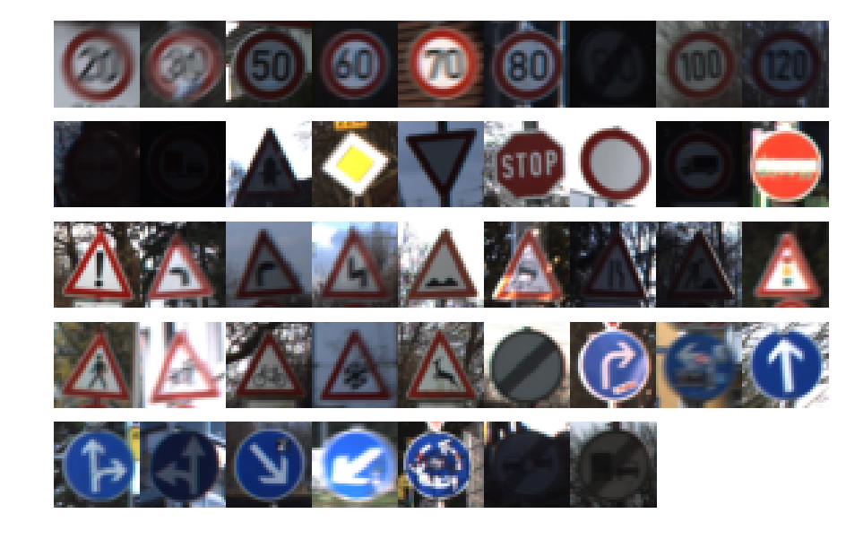
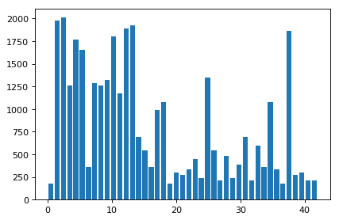
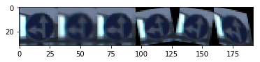
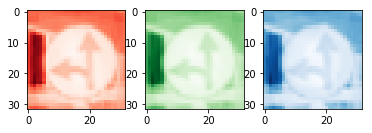
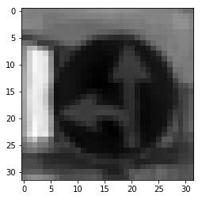
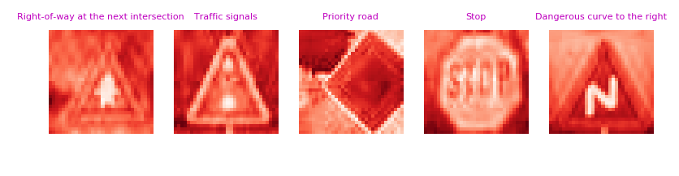
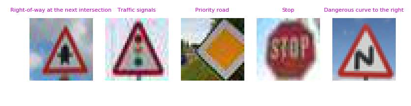

# Traffic Sign Recognition Project

---





---
### README

The project is a pre-processing pipeline and a convolutional neural network model for visual traffic sign recognition from images.  This README comes with a Jupyter notebook of the implementation (python, tensorflow), an HTML version is also provided. 

The model is based on the LeNet architecture with some enhancments, trained on  the German Traffic Signs dataset. Computation requirements are not light, but can be done on a PC in a few hours or overnight. Actual training was done on a dual GPU machine via AWS. 

The model performs well on a test set, but will require extensive enhancment  for usage outside of current sandbox. 


### Data Set Summary & Exploration

#### Basic Summary

```
Number of training examples = 34799
Number of validation examples = 4410
Number of testing examples = 12630
Image data shape = (32, 32, 3)
Number of classes = 43
```


##### Exploratory Visualization

| |
|:--:|
| _number of samples per class_ |

```
['0', 'Speed limit (20km/h)']
['1', 'Speed limit (30km/h)']
['2', 'Speed limit (50km/h)']
['3', 'Speed limit (60km/h)']
['4', 'Speed limit (70km/h)']
['5', 'Speed limit (80km/h)']
['6', 'End of speed limit (80km/h)']
['7', 'Speed limit (100km/h)']
['8', 'Speed limit (120km/h)']
['9', 'No passing']
['10', 'No passing for vehicles over 3.5 metric tons']
['11', 'Right-of-way at the next intersection']
['12', 'Priority road']
['13', 'Yield']
['14', 'Stop']
['15', 'No vehicles']
['16', 'Vehicles over 3.5 metric tons prohibited']
['17', 'No entry']
['18', 'General caution']
['19', 'Dangerous curve to the left']
['20', 'Dangerous curve to the right']
['21', 'Double curve']
['22', 'Bumpy road']
['23', 'Slippery road']
['24', 'Road narrows on the right']
['25', 'Road work']
['26', 'Traffic signals']
['27', 'Pedestrians']
['28', 'Children crossing']
['29', 'Bicycles crossing']
['30', 'Beware of ice/snow']
['31', 'Wild animals crossing']
['32', 'End of all speed and passing limits']
['33', 'Turn right ahead']
['34', 'Turn left ahead']
['35', 'Ahead only']
['36', 'Go straight or right']
['37', 'Go straight or left']
['38', 'Keep right']
['39', 'Keep left']
['40', 'Roundabout mandatory']
['41', 'End of no passing']
['42', 'End of no passing by vehicles over 3.5 metric tons']
```


### Design and Test a Model Architecture

### Imputation
The classes have an unbalanced sample quantity per class. This can bias the model to prefer classes with more training samples. We've balanced the quantities by taking existing samples and,  after slightly deforming,  adding them back into the database. The deformations are: blurring, rotation, scaling, shear, perpective. 

In hindsight, it would've been better to do it for all classes, and with a greater variety/intensity of transformations. 

||
|:--:|
|_image transformations_|


#### Normalization

Normalization is done to prevent bias towards input with measure not in proportion to information content (e.g a dark image of a stop sign taken at night  will have lower pixel intensity values). 

The normalization method is "Simplified Global Whitening", done for each color channel (see notebook). It's supposed to perform somewhat better de-correlation of the features - we've not attempted to do measure effect on the performance of the model. 

In hindsight, should've normalized the color channels against each other as well.


#### Dimensionality Reduction

Judging by the images, most signs are red and blue. Yellow shows up once, but that sign has unique geometry anyway. Green is mostly background vegetation, doesn't show up on the signs themselves.





We've performed a Principal Component Analysis, which indicated the red color channel contains the vast majority of information, therefore we discarded the green and blue channels. So in our case the grayscale images are actually 'redscale'.



In hindsight there are 2 problems:

1. The method is suspect because the channels weren't normalized in relation to each other.
2. It's a waste of time, unless performing optimization or working against various constraints. It would've  saved much time and probably yielded a better performing model if this step was not done.

#### Network Architecture

My final model consisted of the following layers:

| Layer         		|     Description	        					|
|:---------------------:|:---------------------------------------------:|
| Input         		| 32x32x1 RGB image   						|
| Convolution 3x3     	| 1x1 stride, same padding, outputs 32x32x8 |
| RELU					|												|
| Dropout	| drop probability = 0.2 |
| Convolution 3x3	| 1x1 stride, valid padding, outputs 30x30x16 |
| RELU	|         									|
| Max Pooling	| 2x2 stride,  outputs 14x14x16 |
| Dropout | drop probability = 0.2 |
| Convolution 3x3 | 1x1 stride, valid padding, outputs 12x12x32 |
| RELU |  |
| Max Pooling | 2x2 stride,  outputs 6x6x32 |
| Dropout | drop probability = 0.2 |
| Flatten | 6x6x32 -> 1152 |
| Fully Connected | 1152 -> 512 |
| RELU | 	|
| Dropout | drop probability = 0.4 |
| Fully Connected | 512 -> 256 |
| RELU | 	|
| Dropout | drop probability = 0.4 |
| Fully Connected | 256 -> 128 |
| RELU | 	|
| Dropout | drop probability = 0.4 |
| Fully Connected | 128 -> 43 |
| Output | 43x1 |


#### Hyper-Parameters

1. The learning rate was set to 0.0001 due to yielding smoother, more consistent, convergence.
2. The batch size was reduce to 64 - due to same reason as the above clause.
3. Training cycles (epochs) set to 64 - that's roughly how much it took it to converge.
4. Dropout probabilities set to 0.2 for convolutional layers and 0.4 for fully connected layers. High values caused the validation error to be too jittery. 

The Adam gradient descent optimization algorithm was utilized due to ease of configuration. 

L2-regularization was considered, deemed better left for another time. 


### Development

We've started from the initial LeNet implementation. The size and number of layers was iteratively expanded in proportion to reduction in error. Consequentially, dropout layers were added to reduce possible overfitting (more details in the notebook)

#### Sandbox Results

* ```
  Train Accuracy = 0.998
  Valid Accuracy = 0.974
  Test Accuracy = 0.957
  ```


### Tests on New Images

The model did poorly, with an accuracy of only 60%. The stop sign misclassification was surprising, after investigation it looks like it might be due to a lack of zoomed-in images of stop signs in the dataset. The dangerous curve error was due to it not being in the database: the image is of a sign indicating an opposite curve direction to what's provided in the datasset.  More details in notebook.



```
GROUND TRUTH:  Right-of-way at the next intersection
1.  Right-of-way at the next intersection
    1.0
2.  Beware of ice/snow
    3.41095e-08
3.  Pedestrians
    3.18046e-10
4.  Road work
    2.31738e-11
5.  Children crossing
    7.6428e-12

GROUND TRUTH:  Traffic signals
1.  Traffic signals
    0.996741
2.  General caution
    0.00172232
3.  Right-of-way at the next intersection
    0.00094807
4.  Beware of ice/snow
    0.000562289
5.  Road work
    2.25787e-05

GROUND TRUTH:  Priority road
1.  Priority road
    0.997185
2.  Yield
    0.00254995
3.  No vehicles
    0.000169614
4.  No passing
    3.43746e-05
5.  Speed limit (60km/h)
    1.88259e-05

GROUND TRUTH:  Stop
1.  Speed limit (100km/h)
    0.560961
2.  Speed limit (120km/h)
    0.167752
3.  Speed limit (70km/h)
    0.101877
4.  Speed limit (30km/h)
    0.0941417
5.  Speed limit (80km/h)
    0.042617

GROUND TRUTH:  Dangerous curve to the right
1.  Children crossing
    0.766275
2.  Ahead only
    0.233388
3.  Speed limit (60km/h)
    0.000101051
4.  Right-of-way at the next intersection
    6.49906e-05
5.  Turn left ahead
    6.29549e-05
```